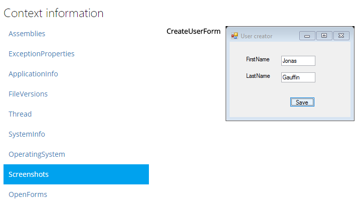

Integration library for WinForms applications
=============================================

[]() []()

This library will detect all unhandled exceptions in WinForms based applications and report them to your codeRR server.


<br>
*Built in error page*


<br>
*Example of captured screenshot when an exception was detected*

# Installation

1. Download and install the [codeRR server](https://github.com/coderrapp/coderr.server) or create an account at [coderrapp.com](https://coderrapp.com)
2. Install this client library (using nuget `coderr.client.winforms`)
3. Configure the credentials from your codeRR account in your `Program.cs`.

### Example configuration

```csharp
public class Program
{
	public static void Main(string[] args)
	{

		// codeRR configuration
		var uri = new Uri("https://report.coderrapp.com/");
		Err.Configuration.Credentials(uri,
			"yourAppKey",
			"yourSharedSecret");

		// to catch unhandled exceptions
		Err.Configuration.CatchWinFormsExceptions();

		// different types of configuration options
		Err.Configuration.TakeScreenshotOfActiveFormOnly();
		Err.Configuration.TakeScreenshots();
		Err.Configuration.UserInteraction.AskUserForDetails = true;
		Err.Configuration.UserInteraction.AskUserForPermission = true;
		Err.Configuration.UserInteraction.AskForEmailAddress = true;


		// The usual stuff
		Application.EnableVisualStyles();
		Application.SetCompatibleTextRenderingDefault(false);
		Application.Run(new MainForm());
	}
}
```

# Getting started

All unhandled exceptions are reported manually. 
But sometimes you need to deal with exceptions yourself. 

To report exceptions manually in your controller, use `this.ReportError(exception)` to allow codeRR to include RouteData, ViewBag, TempData etc when your exception is reported.
If you do not have access to the controller, you can use the `httpContext` (`httpContext.ReportException()`) or just `Err.Report()`. 

```csharp
public ActionResult UpdatePost(int uid, ForumPost post)
{
	try
	{
		_service.Update(uid, post);
	}
	catch (Exception ex)
	{
		this.ReportException(ex, new{ UserId = uid, ForumPost = post });
	}
}
```

# Context collections

This library includes the following context collections for every reported exceptions:

* All in the [core library](https://github.com/coderrapp/coderr.client)
* One property collection for each open form.
* Screenshot of the active form (the one that threw an exception)

# Requirements

You need to either install [codeRR Community Server](https://github.com/coderrapp/coderr.server) or use [codeRR Live](https://coderrapp.com/live).

# Help?

* Questions? http://discuss.coderrapp.com
* Documentation: https://coderrapp.com/documentation/client/libraries/winforms/

